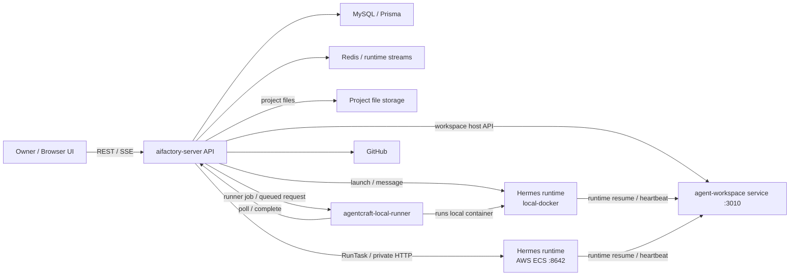
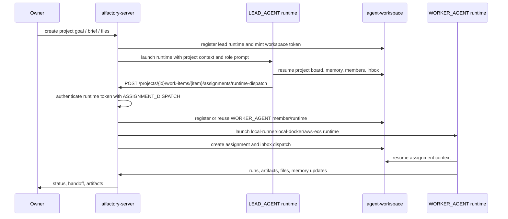
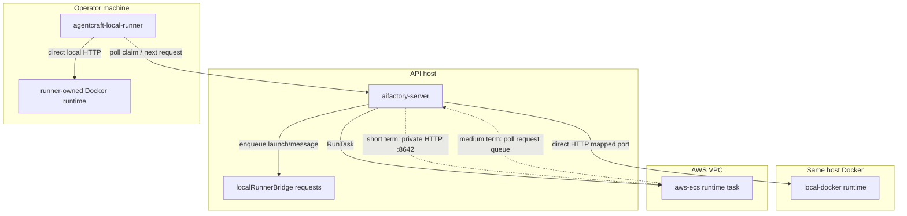
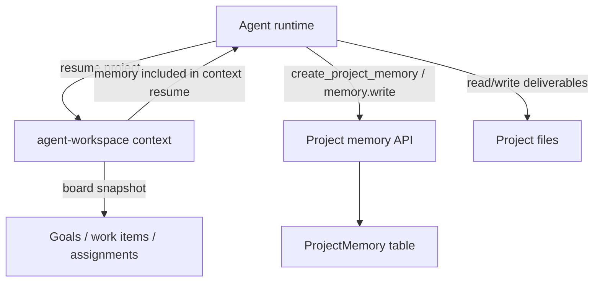
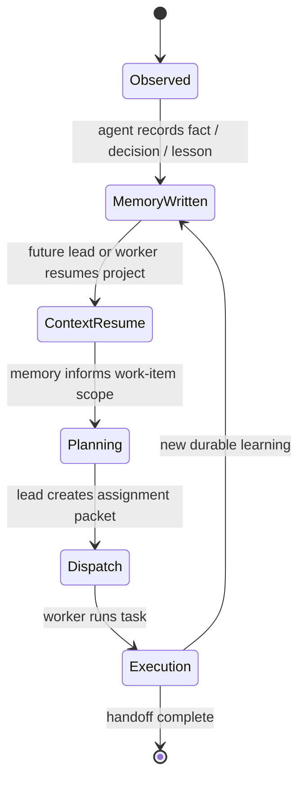
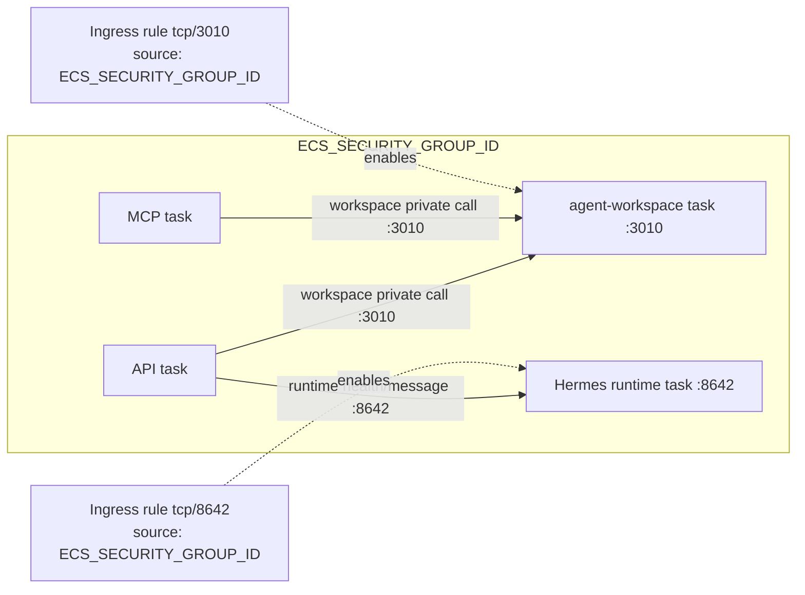
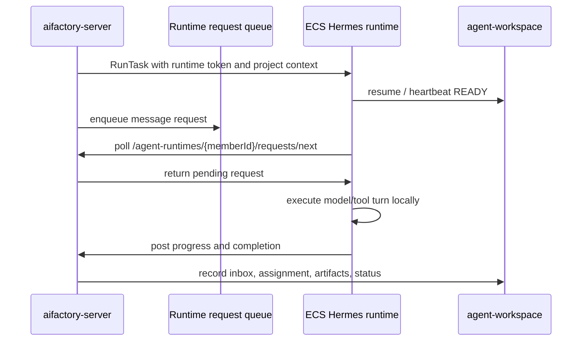

# Agent Runtime Architecture Notes

Last updated: 2026-06-05

This note records the current AgentCraft service components, lead/worker communication paths, agent workspace memory surface, and the short-term plus medium-term fix for AWS ECS runtime delivery.

## Service Components

## Agent Communication

The important invariant is that the lead does not assign worker work to the lead member itself. A lead runtime dispatches through the host API with `AIFACTORY_RUNTIME_TOKEN`; the API either finds a suitable non-lead worker runtime or launches one and assigns the work item to that worker member.

## Runtime Prompt Injection

AgentCraft owns the host-side project and role prompt assembly. `ProjectsService.runtimeSystemPrompt()` builds the base runtime instructions for the project, role, scopes, budget, API routing, shared files, memory, and role-specific operating loops. `AgentRuntimeLauncherService.buildResponsesRequest()` then joins these layers into the `/v1/responses.instructions` payload:

1. host runtime system prompt
2. project/template role prompt (`session.rolePrompt`)
3. skill prompt from `loadSkillPrompt()`
4. conversation-continuity prompt

Skill refs are resolved from role `skillBundleRefs` plus capability-bundle surfaces, with `uniqueStringList()` de-duplicating refs before launch. For local Docker runtimes, the same resolved skills are also materialized under `/opt/data/skills/<name>/` and listed in `AGENT_WORKSPACE_CONTEXT.json`.

Pi runtimes have one extra adapter step. The API sends the merged `instructions` field to the CLI adapter at `/v1/responses`; `docker/agentcraft-cli-adapter.mjs` passes those instructions to Pi as `--append-system-prompt`. Pi then constructs the final provider request as:

1. Pi's own coding-agent system prompt and tool guidance
2. the AgentCraft appended instructions
3. Pi date and current working directory metadata

For Pi, `loadSkillPrompt()` uses progressive disclosure. It injects only the skill ref, description, mounted `SKILL.md` entrypoint, and helper script paths instead of injecting the full skill markdown. The model should read `/opt/data/skills/<name>/SKILL.md` only when the current turn needs that detailed workflow.

Current observation: the skill injection path is not duplicating full `SKILL.md` bodies. The larger prompt cost comes from long template role prompts, especially domain templates that restate rules already present in role or workflow skills. Repeated skill refs in system text are expected when they appear in capability summaries, available-role lists, and progressive skill entries.

TODO:

- Keep template `initialPrompt` values focused on template-specific policy and hard overrides; move reusable role/workflow details into the relevant skill markdown.
- Add a regression check that builds a Pi request and asserts each progressive skill block appears once, no full `SKILL.md` body is injected for Pi, and no `<available_skills>` section is produced unless Pi native skill discovery is intentionally enabled.
- Consider exposing a debug endpoint or saved artifact for the exact merged prompt layers before they are handed to a runtime adapter, so future prompt audits can distinguish host prompt, role prompt, skill prompt, and runtime adapter additions.

## Launch Modes

| Mode | API-to-runtime path | Runtime-to-host path | Notes |
| --- | --- | --- | --- |
| `local-docker` | API starts Docker and calls the mapped local runtime HTTP port. | Runtime calls agent-workspace and host API with env from `AGENT_WORKSPACE_RUNTIME.env`. | Best for same-host development. |
| `local-runner` | API queues launch jobs and message requests. Runner polls/claims, calls its local runtime, then posts progress/completion. | Runner and runtime make outbound calls to API/workspace. | Works across NAT because no inbound connection to the runner machine is required. |
| `aws-ecs` | API starts an ECS task and calls `http://<private-ip>:8642`. | ECS task calls workspace/API using configured base URLs. | Current production issue was API-to-runtime private HTTP reachability. |

## Agent Workspace Memory

Project memory is the durable cross-agent context layer. Worker-capable roles can write memory through their scoped tools/API when they have `MEMORY_WRITE`; lead context resumes should read memory before making planning or dispatch decisions. Memory complements, but does not replace, work items and assignment packets: work items carry executable scope, memory carries reusable facts, decisions, and lessons.

## Security Group Fix

Short-term production fix:

- The ECS deploy workflow now explicitly verifies and creates service-to-service security group ingress for `ECS_SECURITY_GROUP_ID -> ECS_SECURITY_GROUP_ID`.
- Port `3010` keeps API/MCP/workspace private calls reachable.
- Port `8642` keeps API-to-Hermes ECS runtime calls reachable for `/health` and `/v1/responses`.
- The rule is self-referenced because API, workspace, and runtime ECS tasks currently share the same security group.

The immediate symptom this fixes is `fetch failed` from `aifactory-server` when it tries to call `http://<runtime-private-ip>:8642/health` or `/v1/responses` after ECS RunTask succeeds.

## Medium-Term Runtime Delivery Plan

The medium-term fix is to remove inbound API-to-runtime dependency for cloud runtimes and converge ECS runtime messaging onto the `local-runner` style pull model:

Benefits:

- No private IP callback from API to ECS runtime is needed.
- Security group ingress on `8642` becomes optional rather than critical.
- The same request lifecycle can serve `local-runner` and `aws-ecs`.
- Runtime restarts can recover by polling pending requests with the runtime token.
- API only needs outbound AWS ECS control-plane access plus normal database/workspace access.

Until that lands, keep the short-term SG rule in place and verify after each production deploy that the API task security group can reach ECS runtime tasks on `8642`.
